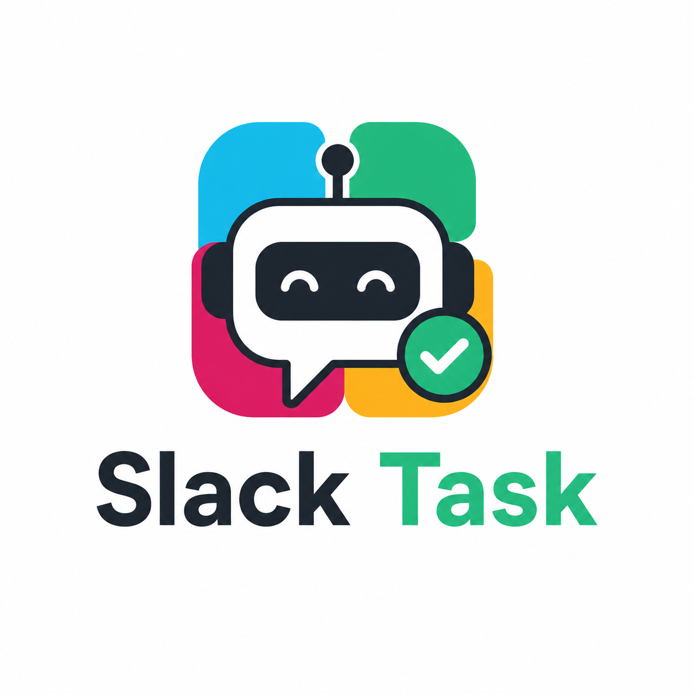

# SlackTask
A simple but powerful Slack Bot to manage tasks and access them externally via REST API.

# Using my installation:
Slack Channel: [https://hackclub.enterprise.slack.com/archives/C0B1NFRUQ5P](https://hackclub.enterprise.slack.com/archives/C0B1NFRUQ5P)

## Commands:
- `/task <task>` - Create a new task
- `/info <task id>` - Get info about a task
- `/tasks` - Get a list of all your tasks
- `/ping` - Get the ping!

## API:
The API is accesable at: [http://api-bot.sander.tf/tasks/](http://api-bot.sander.tf/tasks/)

*Example: my tasks: [http://api-bot.sander.tf/tasks/U0A0A0S987Q](http://api-bot.sander.tf/tasks/U0A0A0S987Q)*

## Installation
```
git clone https://github.com/sanderhd/slacktask
cd slacktask
npm install
```

## Enviroment
Create a `.env` file:

```
SLACK_BOT_TOKEN=
SLACK_SIGNIN_SECRET=
PORT=
API_PORT=
```

## Running 
`node index.js`

Server will run on:
http://localhost:port

## Slack Setup
1. Go to Slack API Dashboard
2. Create an app
3. Enable Slash Commands
4. Create commands:
    Request URL needs to be: https://yourdomain/slack/events

## API
Endpoints:
`GET /api/tasks/userid`

## Database
SQLite database (`tasks.db`) with schema:
```sql
CREATE TABLE tasks ( 
    id INTEGER PRIMARY KEY, 
    user_id TEXT NOT NULL, 
    task_text TEXT NOT NULL, 
    created_at DATETIME DEFAULT CURRENT_TIMESTAMP, 
    completed INTEGER DEFAULT 0 
);
```